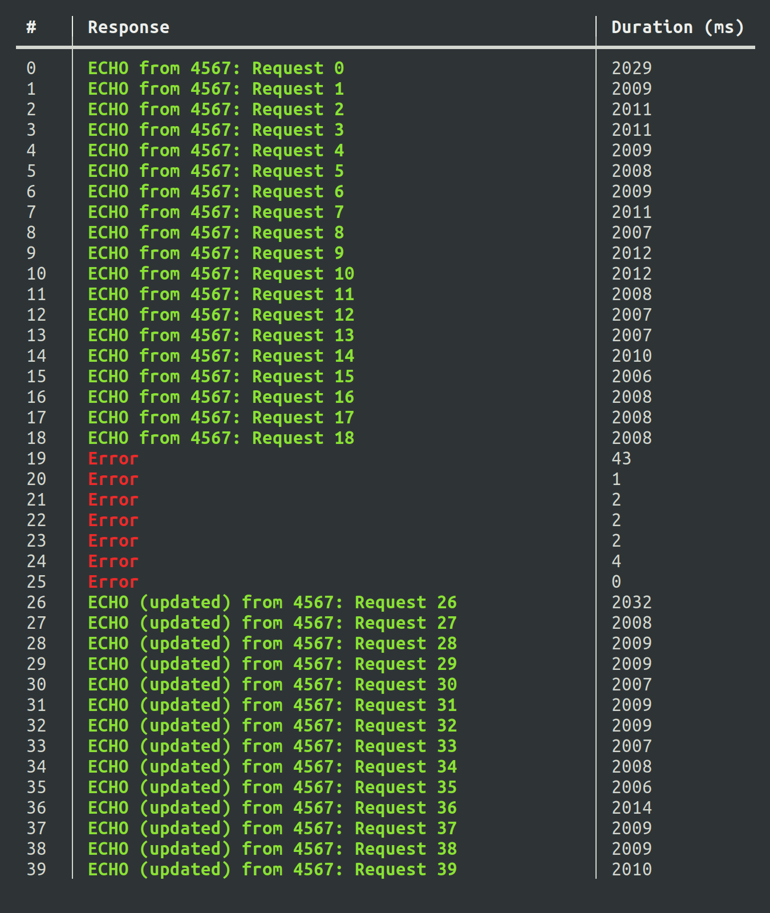
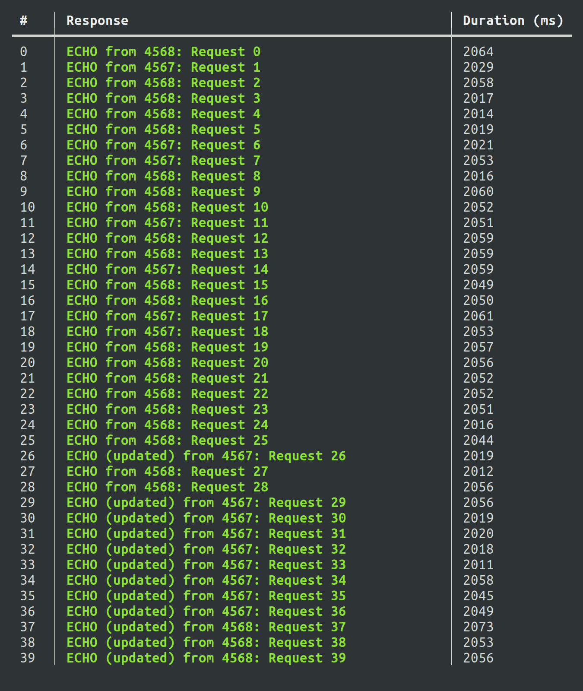

Sinatra Graceful Shutdown
=========================

A sample server and testing utilities to demonstrate graceful shutdowns and zero-downtime deployments.

Quick Start
-----------

[Download and install the Caddy 2 web server.](https://caddyserver.com/docs/download)

```sh
caddy stop  # ensure Caddy is not running already

bundle                          # install dependencies
./test-server.rb single         # test against single server
./test-server.rb load-balanced  # test against multiple load-balanced servers
```

Running the server manually
---------------------------

To see how the server behaves without any of the test scripts, you can run it manually:

```sh
bundle    # install dependencies
./app.rb  # run the server

# Or run with the UPDATED environment variable in order to simulate an updated
# version of the code:
UPDATED=Y ./app.rb
```

Now, in a separate terminal, request an "echo". You'l get an answer after a short delay:

```
$ curl 'http://localhost:4567/wait-and-echo?content=content%20to%20echo'
ECHO: content to echo
```

Or, run the health check:

```
$ curl -i 'http://localhost:4567/health'
HTTP/1.1 204 No Content
<headers omitted>
```

Testing methodology
-------------------

The results of load balancing are not deterministic, so it is recommended to run the tests yourself. However, the screenshots below show what you may expect.

### Single server

In this test, there is only one app server. Requests are made directly to that app server. In the middle of the test, the app server is shut down, and then it is started back up with "new" code (the updated flag is set).

<p align="center"></p>

The first few requests succeed, as long as they were in flight before the app server was shut down. Any requests made after the app server shut down error out, until the app server starts up again.

This corresponds to some downtime during deployments, thought in-flight responses are not dropped. Thus, this demonstrates that Sinatra gracefully shuts down its server.

### Load balanced servers

In this test, there are two app servers, with Caddy load balancing between them. When the "deployment" happens, one app server is shut down, then brought up again before the next app server is restarted.

<p align="center"></p>

This time, pretty much all the requests succeed. This is because when one app server is taken down, the other one handles the requests. You'll see that during the deployment phase, because one app server is running the newer code and theother one running older code, the response is non-deterministic. However, the response is still a success.

In reality, you may find that a few requests return a 200, but with no response. This is due to Caddy not catching up to the fact that one of the app servers is down, and Caddy sending a request to that downstream. But, very few requests exhibit this problem.

While the above is a problem, it's a problem during the moment when an app server is shut down. Caddy quickly catches up due to the frequent health checks. Most importantly, this catch-up period is independent of how long an app server takes to start up, in contrast to the number of failed requests being proportional to the start-up time in the "single server" configuration.

Technologies used
-----------------

The goal of this test is to show a general concept, but I had to pick specific technologies to make the implementation real:

- [Sinatra](http://sinatrarb.com/) - used to implement an app server. Supports graceful shutdowns.

- [Caddy 2](https://caddyserver.com/) - used to implement a load-balancing reverse proxy. Unlike Nginx, Caddy supports active health checks (using a separate endpoint) without a paid upgrade.

- [Ruby curses library](https://github.com/ruby/curses) - used to implement a Terminal User Interface (TUI) that makes the test results much easier to visualize.

- [Docopt](https://github.com/docopt/docopt.rb) - for command line argument passing
